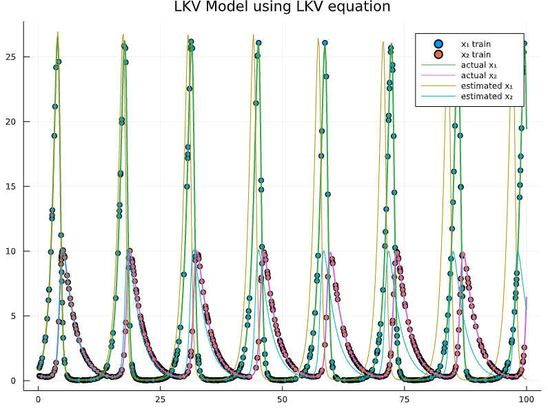
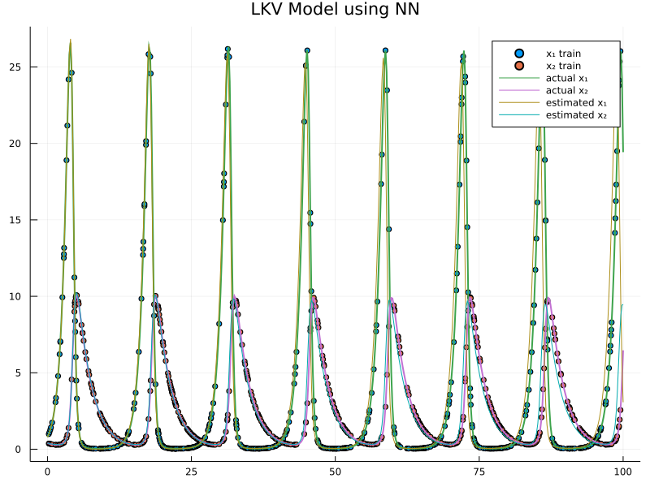
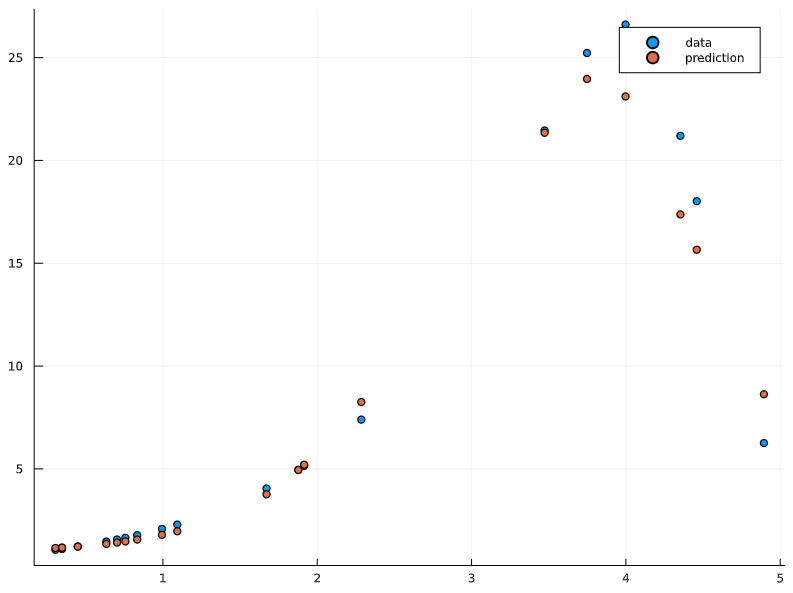
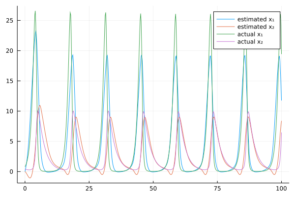

# AMATH563-final-project
Final project for AMATH563(Intro to Deep Learning).

Run `train_lkv_rk4.jl` and `train_lkv_node.jl` to generate plots.
`output/lkv_node.png` is generated by an older version of the code, but is still contained in my paper, so it will stay.

## Backpropagation Through RK4 Directly
### LKV Model Using Learned Parameters

### LKV Model Using FC NN 

## Neural ODE
### Subset of points

### Multiple Shooting Technique
#### Training Animation

#### Result
